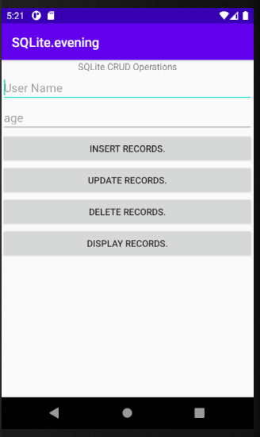
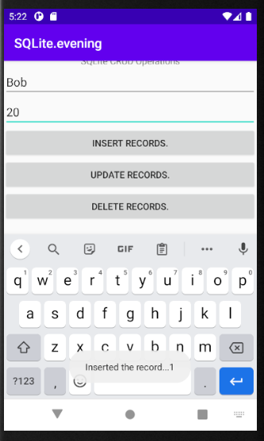
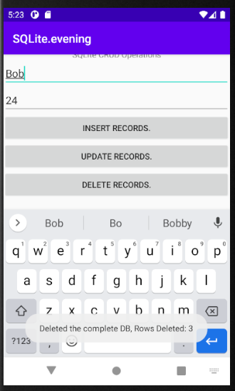
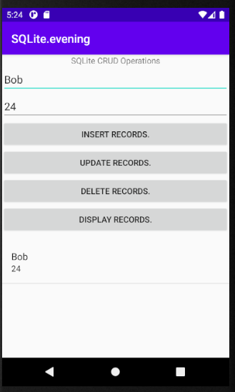

# Android User Info App with SQLite
 Use SQLite to insert, update, delete, and read user information
 
### author: Yi Rong
### date: 07/11/21
---
### 1. Main Interface

### 2. Insert

### 3. Update

### 3. Delete

### 3. Display records after insertion

